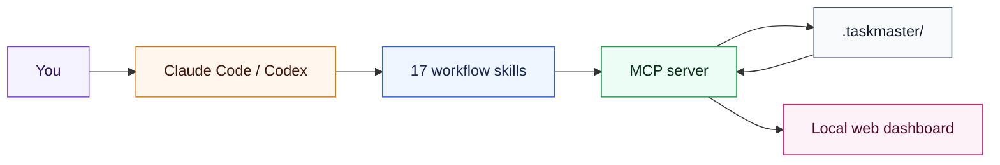

<div align="center">

# Taskmaster

### Give your coding agent a project manager's memory.

Taskmaster is a local-first task and backlog system for AI-assisted software
projects. It gives Claude Code and Codex a shared MCP core, disciplined workflow
playbooks, durable session continuity, and a fast browser-based project board.

[](https://github.com/Gruku/taskmaster/releases)
[](https://www.python.org/)
[](LICENSE)
[](https://docs.anthropic.com/en/docs/claude-code)
[](https://github.com/openai/codex)

[Quick start](#quick-start) · [How it works](#how-it-works) · [Workflows](#built-in-workflows) · [Development](#development) · [Changelog](CHANGELOG.md)

</div>

---

## Why Taskmaster?

Coding agents are good at the work directly in front of them. Long-running
projects need more: priorities, dependencies, decisions, review gates, and a
clean way to continue tomorrow without reconstructing yesterday.

Taskmaster keeps that context in your repository and exposes it through MCP.
Your assistant can plan and track work using natural language while you retain
plain-text, reviewable project data.

| Without Taskmaster | With Taskmaster |
| --- | --- |
| Context disappears between sessions | Handovers preserve the thread of work |
| Tasks live across chat, notes, and TODOs | One structured backlog stays authoritative |
| “Done” depends on the agent remembering checks | Review gates record spec, code, and test results |
| Multiple agents can overwrite project state | Sharded files and merge-aware saves reduce collisions |
| Progress is buried in YAML | A local dashboard makes the project legible |

## Highlights

- **Assistant-neutral core** — one Python MCP server for Claude Code, Codex,
  and other MCP-compatible clients.
- **Durable continuity** — handovers, session threads, decisions, issues, bugs,
  and ideas survive chat boundaries.
- **Real workflow discipline** — task selection, dependency checks, planning,
  spec review, implementation review, and end-of-session capture.
- **Team-friendly storage** — schema v4 stores tasks as individual Markdown
  files with a slim YAML index and merge-aware writes.
- **Local visual workspace** — kanban, tables, epics, sessions, issues, and task
  details in a browser UI served by the same backend.
- **Your repository stays yours** — no hosted account and no proprietary data
  format; the source of truth is committed alongside the code.

## Quick start

### Requirements

- Python 3.11 or newer
- [`uv`](https://docs.astral.sh/uv/getting-started/installation/)
- Claude Code, Codex, or another MCP-capable client

### 1. Get Taskmaster

```bash
git clone https://github.com/Gruku/taskmaster.git
cd taskmaster
uv sync
```

### 2. Connect your assistant

<details open>
<summary><strong>Claude Code</strong></summary>

Run Claude Code with the source checkout loaded as a plugin:

```bash
claude --plugin-dir /absolute/path/to/taskmaster
```

The plugin manifest registers the MCP server and makes Taskmaster's skills
available to the session.

</details>

<details>
<summary><strong>Codex</strong></summary>

The Codex plugin bundle is defined in [`.codex-plugin/plugin.json`](.codex-plugin/plugin.json).
If Taskmaster is available through your configured plugin marketplace, install
it there. For a source-checkout installation, follow the
[Codex adapter guide](adapters/codex/README.md).

</details>

<details>
<summary><strong>Any MCP client</strong></summary>

Configure an stdio server that runs the repository entry point:

```json
{
  "command": "uv",
  "args": ["run", "/absolute/path/to/taskmaster/backlog_server.py"]
}
```

</details>

### 3. Initialize a project

Open the project you want to manage and tell your assistant:

```text
Set up Taskmaster in this project.
```

Choose a clean start or let Taskmaster analyze the repository and propose an
initial backlog. From then on, ordinary language is enough:

```text
What should I work on?
Pick task auth-003.
Review this plan.
Is this ready?
Let's wrap up.
```

Taskmaster stores the shared project state under `.taskmaster/`. Open the local
board by asking your assistant to **open the Taskmaster dashboard**.

## How it works



Taskmaster separates intent from mechanics:

1. **Skills** recognize what you mean and run the appropriate workflow.
2. **The MCP server** validates reads, writes, state transitions, and links.
3. **Repository files** preserve shared state in human-readable Markdown and YAML.
4. **The viewer** renders the same state without becoming a second source of truth.

## Built-in workflows

| Workflow | Example request |
| --- | --- |
| Start a session | “Orient me” or “What should I work on?” |
| Initialize a project | “Set up Taskmaster” |
| Pick work | “Pick task auth-003” |
| Review a spec or plan | “Challenge this design” or “Review this plan” |
| Run the quality gate | “Is this ready?” |
| End a session | “Let's wrap up” |
| Preserve continuity | “Write a handover for tomorrow” |
| Track bugs and issues | “Log this bug” or “File a recurring issue” |
| Record decisions | “We need to choose between these approaches” |
| Audit source TODOs | “Check whether our TODOs are tracked” |
| Sync Linear | “Connect Taskmaster to Linear” |

The universal router selects among 17 focused skills. Small, explicit changes
can remain lightweight; larger work receives the full tracked lifecycle.

## Project data

New projects use the v4 layout:

```text
.taskmaster/
├── backlog.yaml          # Project, phase, and epic index
├── tasks/                # One Markdown file per task
├── bugs/                 # One-off defects
├── issues/               # Recurring or systemic problems
├── decisions/            # Open and resolved decisions
├── handovers/            # Continuity between sessions
├── ideas/                # Lightweight future possibilities
└── local/                # Machine-local cache and viewer state
```

Older v2 and v3 backlogs remain supported. Migration to sharded v4 storage is
available through the `backlog_migrate_v4` MCP tool.

## Repository layout

```text
taskmaster/       Python MCP server and domain logic
skills/           Assistant-facing workflow entry points
playbooks/        Shared, assistant-neutral workflow definitions
viewer/           Browser dashboard
adapters/         Harness-specific integration guidance
hooks/            Claude Code workflow enforcement
tests/            Python and integration test suite
docs/             Design notes, specifications, and deeper documentation
```

## Development

Create the environment and run the Python suite:

```bash
uv sync
uv run --with pytest python -m pytest -q
```

Run the dashboard against a Taskmaster-enabled project:

```bash
uv run python -c "from taskmaster.backlog_server import _make_server; s, p = _make_server(host='127.0.0.1', port=0); print(f'http://127.0.0.1:{p}/'); s.serve_forever()"
```

For UI-specific details, see the [viewer guide](viewer/README.md). Architectural
and behavioral changes are documented in [`docs/`](docs/) and the
[changelog](CHANGELOG.md).

## Contributing

Issues, discussions, and pull requests are welcome.

1. Fork the repository and create a focused branch.
2. Add or update tests for behavioral changes.
3. Run the relevant Python and viewer test suites.
4. Keep workflow behavior synchronized across skills, playbooks, and adapters.
5. Explain user-visible changes clearly in the pull request.

Please report security-sensitive problems privately to the maintainer rather
than opening a public issue.

## License

Taskmaster is open-source software released under the [MIT License](LICENSE).

<div align="center">

Built by [gruku](https://github.com/Gruku) for projects that outlive a single chat.

</div>
