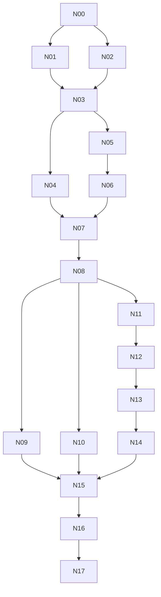

<!-- User intent: create executable plans for database-native Taskmaster, based on
     the measured CodeMaestro-copy performance investigation and architecture discussion. -->

# Database-native Taskmaster implementation plan

**Status:** N00–N08 complete locally; client routing landed on
`feat/native-n08-routing` (activation still test-only). This is an intermediate
checkpoint. Next action: N09/N10/N11, which all depend only on N08; N11 must also
lift the native changelog refusal recorded under N08. Rollout remains outstanding. Merge the branch only
after N03–N17 are complete (user instruction, 2026-09-12); the default branch is
named `master` in this repository.
**Design:** [database-native design](../specs/2026-09-09-database-native-design.md).
**Baseline:** 6.0.2, `e9ea119`. Recheck before implementation; the current audit
reports and benchmark scripts are uncommitted task-owned artifacts.
**Tracking:** this repository has no project backlog; use this plan's ledger and
`docs/handoffs/` rather than modifying CodeMaestro's backlog or initializing one.

## Execution rules

- Implement a reviewable step in an isolated branch/worktree. Preserve unrelated
  changes and the audit artifacts. No live CodeMaestro mutations, installation,
  publishing or project migration are part of this plan's local execution.
- Before each step, read its spec sections, inspect the current callers and
  tests, and update the scope if the code has changed. Do not implement from
  historical line numbers alone.
- Add behavioral tests before production changes; include failures for the
  contracts being changed, not tests that merely duplicate implementation.
- Run focused tests while iterating. At a step boundary run the affected
  integration suites; run the full suite at each milestone and before release.
  Use the working repository interpreter; verify it rather than assuming `.venv`
  is accessible in a sandbox. Do not regenerate dependency files unnecessarily.
- Benchmark only marked isolated copies. Pin source SHA, Python/SQLite versions,
  fixture digest, process count, warmup and storage conditions. Keep private raw
  data in ignored `test-results/`; commit only sanitized metrics and scripts.
- Keep the old full algorithms as test oracles until equivalence is proven.
  Never run shadow production mutations twice. Neither compilation nor a faster
  benchmark counts as a migration/correctness gate.
- Record completion evidence and remaining limitations in the ledger. A pending
  release/migration gate is not completed by a local merge.

## Milestones and dependency graph

| Milestone | Steps | Deliverable |
|---|---|---|
| M0: safe foundation | N00–N02 | Reproducible measurements; forward-schema refusal; compatibility inventory |
| M1: native core | N03–N07 | Relational schema, targeted queries/commands, selective derived state |
| M2: agent and viewer usage | N08–N10 | Core-backed adapters, bounded context, compact HTTP/change contracts |
| M3: native synchronization | N11–N14 | Durable outbox, service ownership, explicit sync and managed Git barriers |
| M4: cutover and acceptance | N15–N17 | Migration rehearsal, scale/crash validation, release-ready package |

```mermaid
flowchart TD
    N00 --> N01
    N00 --> N02
    N01 --> N03
    N02 --> N03
    N03 --> N04
    N03 --> N05
    N05 --> N06
    N04 --> N07
    N06 --> N07
    N07 --> N08
    N08 --> N09
    N08 --> N10
    N08 --> N11
    N11 --> N12
    N12 --> N13
    N13 --> N14
    N09 --> N15
    N10 --> N15
    N14 --> N15
    N15 --> N16
    N16 --> N17
```

The graph expresses dependencies, not an instruction to launch parallel agents.

## N00 — Establish test oracles and isolate the FTS diagnostic

**Depends on:** none. **Scope:** harnesses and focused regression tests.
**Files:** audit scripts; new `tests/test_native_baseline.py` and a focused FTS
reproducer; existing store concurrency/recovery tests.

1. Reproduce the long-lived-connection FTS integrity result with unchanged runtime
   code. Compare fresh/retained connections, explicit snapshots, rollback,
   checkpoint, concurrent writes and supported SQLite versions independently.
2. Determine whether this is persistent corruption, stale virtual-table state,
   diagnostic sequencing or a runtime defect. Fix the demonstrated cause or pin
   a verified supported runtime policy with a regression test. Never auto-rebuild
   authoritative state merely to hide an unexplained diagnostic.
3. Add canonical read/write outcome captures and graph/FTS/artifact comparison
   helpers. Correctness comparisons run outside timed regions.
4. Record original and optimized algorithm counters, tool result sizes and
   projection overhead as separate metrics.

**Exit:** reproducible baseline; FTS cause and supported behavior documented.
Investigation may continue alongside inventory, but schema/recovery acceptance
cannot waive it. No claimed tail percentiles from three-sample runs.

## N01 — Ship-safe forward-schema and client fencing

**Depends on:** N00. **Files:** `store.py`, `root.py`, startup/hooks/version tests.

Replace newer-schema rebuild behavior with read-only refusal. Ensure cold and
already-open store paths refuse unsupported schema/protocol transitions before
mutating tables, reservations, projection files or queues. Add bridge capability
metadata and a migration/ownership admission check with a documented lifecycle.

Test 6.0.2-era behavior in an isolated fixture to demonstrate the hazard, then
test the bridge across MCP, viewer, hooks, scripts and Linear. Inventory installed
launch paths and how they will be stopped/upgraded at real cutover. Protect
existing open handles; a tracked projection marker alone is not sufficient.

Apply N00's diagnostic policy at this admission path, which the first pass of
this step did not do: a corruption verdict from a retained connection must be
confirmed against a fresh read-only snapshot before it can reach recovery.
Until that landed, a peer commit to `entity_fts` made a healthy store's
`quick_check` report a malformed FTS5 index and the live database family was
renamed aside and rebuilt from the lagging projection (B-092).

**Exit:** an unknown newer DB is unchanged after every supported entry point,
**and** no retained-connection diagnostic can rename a healthy database aside
while genuine, snapshot-confirmed damage is still detected and recovered
([B-092 evidence](../reports/2026-09-16-b092-false-corruption.md)).
Bridge installation is a later authorized rollout prerequisite, not performed
automatically by this step.

## N02 — Freeze the public compatibility and field-ownership inventory

**Depends on:** N00. **Files:** new native contracts/inventory fixture; docs matrix.

Enumerate every registered tool and route, hook, script and Linear operation.
Classify it as targeted query, simple command, composite command, synchronization,
maintenance or legacy export. Record expected defaults, field types, result
shape, error behavior, limits, gate rules and side effects.

For each kind, map every field to canonical column/document/membership/extension
storage. Include all kinds, project/backlog configuration, typed dates/scalars,
unknown fields, archive state, invalid references and ID allocation behavior.
Inventory all consumers of legacy SQL names, FTS shadow access and the `related`
table. Machine-check inventory against tool registration and allowed query names.

**Exit:** no unclassified mutating caller or field; concrete compatibility matrix
and schema ownership inputs for N03. New APIs are explicit additions.

## N03 — Relational schema and transactional additive backfill

**Depends on:** N01, N02. **Files:** new `native/db.py`, `schema.py`, `migrate.py`;
`tests/test_native_schema.py`, `test_native_migration.py`.

Specify and implement DDL for core rows, documents/extensions, stable integer
keys, memberships, events/receipts and projection metadata. Add indexes based on
query plans, including changed-entity sequence and reverse memberships. Retain
opaque extension data, explicit unresolved references and legacy event sequence.

Backfill from a consistent existing DB snapshot, not only projected files. Build
within a migration transaction or a checkpointed staging process with an explicit
atomic activation step; test interruption at each stage. New reads remain gated
until backfill equivalence passes. No independently writable old/new stores.

Probe required SQLite capabilities. JSON text is the baseline; JSONB and a new
SQLite dependency are not silently introduced. Emit schema/protocol manifests
that N01 clients understand and older clients refuse.

**Exit:** all fields/counts/IDs/revisions/local-only state preserved; repeatable
backfill; rejection/rollback leaves old authority intact.

## N04 — Targeted query repository

**Depends on:** N03. **Files:** `native/queries.py`, `documents.py`, `search.py`;
`tests/test_native_queries.py`, `test_native_read_snapshots.py`.

Implement get/list/filter/page for all entity kinds; task/epic/phase summaries;
dependencies, memberships, direct search and explicit document section retrieval.
Use stable pagination ordering with an explicit snapshot/cursor consistency rule.
Expose a snapshot context so composite reads reuse it.

Introduce read-only compatibility views or adapters for public SQL contracts.
Update query authorizer tests for permitted view expansion without exposing
private tables. Keep FTS ranking/tokenization and query deadlines intact.

**Exit:** semantic parity with N02 fixtures; no full-tree or file reads for native
bounded queries; query-plan and scanned/materialized-row budgets pass.

## N05 — Command transactions, revisions and durable retry receipts

**Depends on:** N03. **Files:** `native/commands.py`, `contracts.py`, `events.py`,
`receipts.py`; command/idempotency/concurrency tests.

Build one transaction owner with pre-admission argument checks, current-state
domain validation, compare-and-swap revisions, events and commit receipts.
Implement scope/key/payload-hash deduplication before checking stale revisions.
Keep no-op semantics and distinguish cancellation-before-execution from unknown
post-admission outcome. Add all-or-nothing structured batches.

Start with task metadata and note creation as vertical slices. Verify outcomes
from committed snapshots/receipts, not a post-commit read that a peer may change.

**Exit:** same-key retries create once, mismatched reuse conflicts, stale revisions
never overwrite peers, and injected failures leave no partial events/state.

## N06 — Selective derived maintenance

**Depends on:** N05. **Files:** `native/relations.py`, `search.py`; graph/FTS tests.

Track input changes independently for FTS, paths, memberships, declared links,
reverse access and summaries. Use stable FTS document keys. Port the grouped/
prefix graph algorithm as the exact rebuild oracle; preserve duplicate weights
and every current lifecycle/glob rule.

Native metadata-only edits must not rebuild path graphs or unrelated search
documents. Implement current graph correctness before moving to neighborhood
queries. Test fields entering/leaving indexes, imports, archive/unarchive,
tombstones, duplicate claims and explicit inverse links.

**Exit:** exact FTS and graph parity under randomized/domain fixtures; counters
prove zero global rebuild for edits with unchanged relationship inputs.

## N07 — Complete lifecycle and composite commands

**Depends on:** N04, N06. **Files:** command handlers and focused domain tests.

Port every N02 command family: create/edit/archive, handover create/supersede/
status, decision resolution, bug/issue promotion, task pick/complete/gates,
epic/phase transitions, typed links, project settings and Linear link/outbox.
Preserve task claim eligibility, reservations and non-recycled IDs.

Maintain one transaction for composites and one domain rules layer for tool and
HTTP callers. No remote API call occurs inside it. Queue/tracker maintenance
must not rebuild an unrelated graph. Document intentional changes separately.

**Exit:** N02 mutation inventory fully mapped; existing completion/gate/claim,
handover, batch, auto-link and Linear tests pass through the new core.

## N08 — Route existing clients through the native core

**Depends on:** N07. **Files:** `backlog_server.py`, `store.py`, viewer adapters,
hooks/scripts/Linear adapters, bypass and compatibility tests.

Switch tool families incrementally behind project/runtime capability checks.
At this stage preserve synchronous projection behavior via a compatibility
adapter, so query/command correctness is isolated from export semantics.
Keep one authority for both legacy-named and new commands.

Add a bypass gate: native normal reads/commands cannot call `_load()`,
`load_dict()`, `transaction_dict()` or scan projection files. Allowlist only
explicit sync, adoption, compatibility snapshot and maintenance operations.
Track remaining fallback calls until the normal-path count is zero.

Two N07 constraints bind this step.

**The session changelog forces an explicit choice, and there is no option that
is merely safe.** The native completion queues its PROGRESS.md paragraph into
`sync_state.pending_progress_log`, which no exporter reads until N11. Routing
`backlog_complete_task` as-is therefore stops the paragraph reaching PROGRESS.md
silently — text that exists nowhere else. Compensating by also calling the
legacy `_append_changelog` records it in both stores, so it renders twice the
moment N11's drain lands. Pick one deliberately and write the choice down: either
keep completion on the legacy writer until N11, or route it and pass the
paragraph only to the legacy queue, leaving the native argument unused. Do not
let the adapter do both by default.

> **N08 outcome (2026-09-17):** neither option is feasible. The legacy writer
> refuses a native database, and the legacy changelog queue is a `meta` write that
> invalidates the native manifest. On a native store a completion carrying
> `session_title`/`done`/`auto_summary` is therefore refused with nothing changed;
> N11 must queue the paragraph once its drain exports it. There is also no
> native-to-legacy "fallback" to count: unrouted tools refuse. See the
> [N08 report](../reports/2026-09-17-native-n08.md).

**Do not forward a whole `backlog_batch_update` line-set into the native
structured batch**: the tool applies the lines it can and reports per-line
errors, while the native batch is all-or-nothing, so the adapter must
pre-validate lines or one refusal silently discards the rest.
`tests/test_batch_partial_apply.py` pins the tool's contract.

**Exit:** all legacy tools/routes use the core with compatible receipts/errors;
full suite and copied-CodeMaestro parity pass. This is M1/M2 local compatibility,
not asynchronous/native-mode activation.

## N09 — Agent context, change queries and atomic claims

**Depends on:** N08. **Files:** context/query contracts, events, tool adapters;
context/cursor/claim tests and playbook updates.

Add bounded `context`, scoped `changes_since`, document detail and structured
mutation interfaces. Prioritize mandatory blockers/gates, then selected context;
return encoded-byte budgets, omission counts, provenance and continuation tokens.
Add atomic eligible-task claim/renew/release with conflict and expiry behavior.

Cursor tests cover store rebuild, history expiration, scope changes, filtered
removal and multi-entity commit grouping. Preserve existing tool names; do not
replace them with an untyped all-purpose dispatcher. Update examples to avoid
repeated full status/list calls.

**Exit:** representative agent journeys require fewer calls/bytes while yielding
the same required context; missing mandatory context is never reported as clear.

## N10 — Viewer DTO, conditional GET and scoped deltas

**Depends on:** N08. **Files:** viewer HTTP routes; `viewer/js/api.js`, `main.js`,
state/detail consumers; HTTP/client tests.

Define board DTO fields from the actual consumer inventory. Remove duplicated
tasks and private `_rows`; lazy-load prose. Implement client ETag retention and
cheap coherent 304 responses. Add scoped delta/removal application and full
resync fallback; combine detail-related reads from DB snapshots.

Measure wire bytes, server construction, client parse/render and heap behavior.
Do not infer UI responsiveness from HTTP timings. Update consumers before
removing fields; preserve edit preconditions and unknown task handling.

**Exit:** unchanged board GET returns 304/no body; no duplicate task payloads;
detail editing/navigation and filter membership updates pass browser checks.

## N11 — Durable projection outbox with synchronous compatibility drain

**Depends on:** N08. **Files:** `native/projection.py`, events/schema additions;
outbox/recovery/property tests.

Persist projection jobs with commands and immutable revision inputs. Implement
lease recovery, expected-base verification, coalescing, archive moves, tombstones
and quarantine. Initially drain synchronously through the new outbox adapter so
existing visibility remains unchanged while the recovery protocol is tested.

Inject failure before/after DB commit, temp write, replace, manifest update and
job acknowledgement. Test a newer DB edit and an external file edit while an old
job is rendering. Compare lossless v4 artifacts and unchanged-byte behavior.

**The exporter must also drain `sync_state.pending_progress_log`.** N07's native
completion queues its PROGRESS.md session paragraph there, because every write to
the legacy `meta` row fires the staging-invalidation trigger and would fail the
command's own authority check. Until this drain lands, that key only accumulates
and N08 must not route a completion carrying a changelog. Two pending stores now
exist — the legacy `meta.pending_progress_log` the current exporter reads, and
the native one — and N15 must reconcile whatever sits in both at cutover rather
than assuming either is empty.

Two details for whoever builds that drain. The stored shape is the same
`[{"ts", "text"}, …]` list `store._progress_entries` already parses, so the
drain needs no format conversion — only a second source. And the writer reads
and rewrites the whole JSON blob per completion against an unbounded list, so
it is quadratic in completions over a store's lifetime; the legacy pending list
has the same property, and the applied-log cap does not bound it. Bound it or
move it to rows when the drain lands.

**Exit:** no committed effect loses its export intent; no stale job overwrites
newer content; retry/rollback preserves authored data and local-only state.

## N12 — Repository coordinator and asynchronous exporter

**Depends on:** N11. **Files:** `native/service.py`, `client.py`, protocol/lifecycle
tests, launch adapters.

Implement exclusive repository ownership, authenticated local discovery,
root/schema/protocol handshake, write queue admission and exporter/importer
coordination. Thin MCP clients forward validated envelopes. Hooks may use
versioned read-only views without importing the service runtime.

Native mode commits before export and returns pending projection receipts.
Legacy visibility mode uses the same service with a barrier before returning.
Test start races, stale PID/nonce, restart, cancellation, client disconnect,
protocol mismatch and Windows process cleanup. No silent fallback writer.

**Exit:** multiple clients share one coordinator; worker failure is recoverable;
normal native commands contain no projection rendering or filesystem scanning.

## N13 — Explicit sync/import and Git generation barriers

**Depends on:** N12. **Files:** `native/sync.py`, CLI/adapters, root/Git hooks;
sync/worktree/merge/crash tests.

Implement the design's finite `flush_through` and import barrier. Parse external
changes outside the writer transaction, revalidate file/base/revision identities
before apply, and route accepted changes through native commands. Preserve
quarantine, three-way merges and absence-not-deletion.

Integrate pre-commit publication ownership and pre/post-checkout synchronization.
Provide explicit operations for hosts that bypass hooks. Exercise linked
worktrees, branch changes restoring an older projection marker, conflicts,
partial file publication and a writer racing Git staging.

**Exit:** managed Git operations capture coherent projections; bypassed operations
are detected/reconciled with honest pending/conflict status, never silent loss.

## N14 — Consumer graph migration and compatibility completion

**Depends on:** N13. **Files:** relations, query guard/views, edit hook, graph
consumer tests and API docs.

Move hook neighborhoods and typed graph queries to canonical claims/edges and
indexed reverse access. Retain the exact full materializer as repair/oracle and
for any supported SQL workflow that requires it. Decide its public freshness
mechanism in the compatibility matrix before disabling eager materialization.

Add bounded recursive dependency traversal and verify weighted/current/archive
behavior. No unannounced top-K or relevance changes. If direct `related` SQL must
remain always current for this release, retain selectively maintained storage
and document on-demand replacement as a later capability, not unfinished native
command work.

**Exit:** native commands pay only for changed relation inputs; supported graph
consumers retain documented freshness and answer semantics.

## N15 — Migration and downgrade rehearsal

**Depends on:** N09, N10, N14. **Files:** migration command, dry-run/report tooling,
backup/restore tests, operator runbook.

Rehearse the complete bridge → quiesce → reconcile → consistent backup → backfill
→ compare → activate sequence on copies. Preserve historical seq/IDs, queues,
reservations, quarantine, unknown fields and in-flight export jobs, and
reconcile both pending changelog stores (`meta.pending_progress_log` and
`sync_state.pending_progress_log`) rather than assuming either is empty. N11 seeds native from `meta` once, read-only, behind
`sync_state['progress.seeded']` ([N11 report](../reports/2026-09-22-native-n11.md)),
so the cutover verifies that seed. Refuse active
old clients and incompatible launchers; test both warm and cold clients.

Crash at each durable migration stage. Prove pre-activation rollback and post-
activation roll-forward. Test code rollback only to a schema-capable version.
Specify a separate reverse migration if old-format downgrade is supported;
restoring a pre-migration snapshot must not discard newer acknowledged writes.

**Exit:** executable dry-run and recovery runbook with evidence; zero live project
migrations during development. Native activation remains a release decision.

## N16 — Scale, durability and end-to-end acceptance

**Depends on:** N15. **Files:** perf/stress fixtures, crash harness, final report.

Run the matrix below using uninstrumented latency samples and separately enabled
work counters. Include full suite, native process/IPC and actual viewer workflows.
Resolve correctness failures before accepting performance numbers. The FTS
diagnostic must have a supported, explained outcome.

| Axis | Required cases |
|---|---|
| Dataset | Small synthetic, copied CodeMaestro, 10× synthetic with controlled path/edge distribution |
| Reads | Warm/cold, scoped details/search/context, unchanged/delta viewer, reads during writes |
| Writes | Metadata, prose, path/link/membership, create/archive/composite, no-op/invalid input |
| Clients | 1, 4, 8, 12; same entity and disjoint entities; duplicate request retries |
| Sync | No external edits, dirty projections, conflict, checkout/worktree, missing files |
| Failure | Process kill, expired lease, blocked file replacement, disk/commit errors, client disconnect |
| History | Cursor scope change/expiration, store rebuild, filtered removals, multi-entity commit |
| Migration | Old bridge/new clients, stopped/active old runtime, interrupted cutover, recovery |

For steady-state distributions use at least 200 measured operations per selected
scenario after warmup; report p50/p95/p99, errors and worst observed latency.
Keep cold/adoption runs separate. Record lock wait/hold, DB time, rows read/written,
files stat-ed/parsed, graph candidates, output bytes, cache hits, RSS/allocations,
export lag and IPC startup. Scaling tests must distinguish growing required
output from growing unrelated data.

Targets from the design are provisional budgets. Deterministic work assertions
(zero global graph work on metadata edits, no full-tree materialization, no normal
command file scan) are stronger gates than machine-sensitive microsecond limits.

**Exit:** all correctness gates pass; performance improvements and remaining
limits measured without claiming model/network latency as DB performance.

## N17 — Documentation, release candidate and rollout boundary

**Depends on:** N16. **Files:** README/changelog, playbooks, adapters/manifests,
runbooks and final handoff.

Document commit versus projection receipts, sync/Git obligations, migration
requirements, service recovery, context/delta usage and compatibility support.
Test packaged launch paths and version alignment. Choose the release version
after the compatibility impact is reviewed; do not preassign a patch version to
a behavioral/schema migration.

Prepare a concrete release candidate and copied-project demonstration. Publishing,
installation and live CodeMaestro activation require their own authorized step.
Release evidence must distinguish local tests, packaged runtime and actual
project migration. Do not mark native rollout complete on a local green suite.

**Exit:** reviewed release candidate, validated packaged launch paths and a
complete operator handoff. Publishing and live activation remain separately
recorded release actions, with no implied deployment from this step's completion.

## Execution ledger

All entries start **planned**. Update with commit, validation artifact and any
explicitly deferred scope when implementation actually occurs.

| Step | Status | Commit / evidence |
|---|---|---|
| N00 | complete locally | `c940697`, `7470757`; [FTS matrix (40 cases), diagnostic policy and baseline oracles](../reports/2026-09-09-native-foundation.md) |
| N01 | reopened for B-092, then complete locally; bridge rollout pending | `4aa6694` plus reservation-test follow-up, `92073f2` admission gate; [admission and cutover contract](../handoffs/2026-09-09-native-client-fencing.md), [diagnosis](../reports/2026-09-16-store-false-corruption.md), [fix evidence, 4/60 → 0/60](../reports/2026-09-16-b092-false-corruption.md) |
| N02 | complete locally | [83 tools, route/field/SQL contracts and ownership map; M0 validation below](../specs/2026-09-09-native-compatibility.md) |
| N03 | complete locally; activation gated | [Schema, transactional backfill, crash tests and 3,559-row copied-fixture evidence](../reports/2026-09-12-native-core.md) |
| N04 | core complete locally; adapter parity remains N08 | [Bounded reads, snapshots, SQL isolation, stored/external document retrieval](../reports/2026-09-12-native-core.md) |
| N05 | core complete locally | [Atomic owner, CAS, retry receipts, batches and immutable projection inputs](../reports/2026-09-12-native-core.md) |
| N06 | core complete locally | [Selective graph/FTS maintenance and full-rebuild equivalence oracles](../reports/2026-09-12-native-core.md) |
| N07 | complete locally; activation gated | `ce2e1b9`…`636b563` (13 commits); [26 further operations, shared rules layer, inventory coverage and nine recorded intentional differences](../reports/2026-09-16-native-n07.md). Two adversarial review passes found **eight** defects, all fixed: bundle pick resurrecting archived tasks, unvalidated `project.set` manifests, cascade Linear enqueues in `_epic_archive` and `_phase_advance`, lock-check ordering, a vacuous `global_graph_rebuilds` counter (deleted), handover membership declared as `tasks` instead of `task_ids` (staging schema 3, one-line frozen-contract change), and a raw `sqlite3.ProgrammingError` on a malformed `bundle`. Field shape/presence and transitive purity both verified clean by oracle. |
| N08 | complete locally; activation gated | `b6637bd`…`a60cf81` (41 commits, including the review pass); [every normal-path tool/action, the viewer HTTP routes, the three store-reading hooks, `backlog_validate` and three host/external actions routed; bypass gate with normal-path fallback count 0; eleven maintenance/sync operations refuse on native stores with operator guidance](../reports/2026-09-17-native-n08.md). Changelog-carrying completions refuse until N11. One adversarial review pass found **four** defects, all fixed test-first: the viewer mistook an unservable native store for a legacy one and 500'd instead of refusing it, the merge recorder could lose a stamp with no log line, `NativeUnavailable` used prose where `backlog_link`/`backlog_linear` callers parse JSON, and the close gate silently completed a task with an open bug whose `found_in` was list-shaped. Four further categories verified clean (batch pre-validation, the eleven refusals, merge-gate fail-open, bypass-gate leaks). A non-hermetic parity oracle was also found and fixed: `compute_issue_aging` read real wall-clock past the test clock, making the viewer twin time-dependent. Full suite on frozen `a60cf81`: **2,940 passed / 1 skipped / 0 failed** of 2,941, 1,637 s. Copied-CodeMaestro parity: 76 tool calls and five mutations against a 3,662-entity copy and its native twin, answers, committed state, projected files, 3 resurface paths and 6 gate branches all identical, **0 failures**. |
| N09 | complete locally; activation gated — exit met, per the user's reading of 2026-09-21: "a journey meets it when it uses fewer calls and its bytes are not materially worse" (bound: 10% above the old path). Pick and resume need fewer calls and fewer bytes on both stores; orient (+4.4%) and close (+1.5%) need fewer calls with bounded byte overhead that is required context. `mandatory` matches the close gate on every bug severity. On the CodeMaestro copy all four journeys need fewer calls on both stores and none regresses | `aac9a01`…`7cdcad6` (92 commits excluding master's 6.0.3, 78 non-merge; the range also carries the 6.0.3 back-merge and the N11 scope); [`backlog_context`, `backlog_changes_since`, `backlog_document`, `backlog_document_import` and `backlog_claim` added, `backlog_get_task`/`backlog_pick_task`/`backlog_batch_update` extended additively, nothing renamed, all dual on legacy and native](../reports/2026-09-21-native-n09.md). "Never reported as clear" is proven by the §5.2(1) invariant gate (5 seeds × 30 tasks against an independent oracle, legacy == native) with every availability reader pinned to it; the "fewer calls/bytes" half is measured by `tests/test_agent_journeys.py` (seeded, both stores, after the compact answer): pick 6→4 calls and 5,149→3,403 B, resume 6→4 and 2,284→1,405/1,565 B, orient 3→2 but 2,341→2,443 B, close 6→5 but 860→873 B (orient and close within the 10% bound, asserted). Context now blocks on every open bug the close refuses on, and the §5.2(1) gate checks it (the gate had never exercised bugs; fixed). On a CodeMaestro copy (2,457 tasks, 4,925 change rows; rerun alone 2026-09-22 at `82f8fe6`, both stores): orient 3→2 calls and 148,106→144,991 B, pick 6→4 and 168,201→19,495 B, resume 6→4 and 26,785→8,330 B (legacy) / 8,482 B (native), close 7→6 and 1,467→1,486 B (+1.3%, within the bound); the old pick path names none of the 3 required gates and the old resume path misses 3 of 5 required items. Scoped `changes_since` takes ≤22 ms in SQL over 4,677 events and 17.7–96.3 ms per native tool call over 4,925, so no index is needed. Only the pick-task playbook changed ([report](../reports/2026-09-21-native-n09.md#journey-measurement-the-exits-first-half)). Shipped-behaviour changes (scope §4f): only the claim tools write `locked_by`, a terminal status always releases a claim and leaving one clears it, a malformed `depends_on` blocks as unreadable instead of raising, and pick/`next_available` no longer hand out a peer-claimed task. Findings: one integration defect (context and claims held two liveness rules and together reported a held task clear), review A **4**, review B **6**, review C **6**, review D **3**, and a final re-probe clean, all fixed test-first on both stores; each sat between tracks or stores that passed their own tests. Carried forward: `budget.budget` quadratic to N16, viewer claim-expiry display to N10, native flag notices and exporter-lease visibility to N11. Full suite at `3421d42`: **3,464 passed / 1 skipped / 0 failed**, 1,362 s, `-n 6`. |
| N10 | complete locally; activation gated | `aef3edc`…`fde1648` plus final evidence follow-up; [compact board DTO, row-sequence ETags/deltas, coherent per-task edits and final copy-only measurements](../reports/2026-09-22-native-n10.md). Client units: 325 passed. Browser matrix: 46 passed. Full Python: 3,671 passed / 1 failed / 1 skipped, then the unchanged architecture guard passed after relocating the prepared N12 IPC package; all 3,672 non-skipped baseline cases passed across those runs, not one clean invocation. Twenty serialized Chromium measurements: board body 89.15% smaller; all ten current 60-second idle windows had zero long tasks; historical modals failed the existing scalar-blocker defect, so no modal speedup ratio. Changed-board paint remains expensive. No installation or live activation. |
| N11 | complete locally; activation gated — exit met for projection files and changelog paragraphs; PROGRESS.md's own file keeps two recorded windows (a stale render can transiently drop paragraphs that the next render restores; a hand edit between read and replace is overwritten, as on legacy) | `4fbbff5`…`7448204` (protocol, 22 non-merge commits, merged `22052d4`) and `506d203`…`1aa33c3` (changelog, 4 commits, merged `b3cbebc`); [durable projection outbox: exporter lease with generation fence, latest-per-file claim, per-job ack, aside-verified no-overwrite install, expected-base verification, native flag-and-keep-both (D2), write-then-remove moves, tombstones and retention, `backlog_resolve_conflict take="store"`; paragraph rows, one-time `meta` seed and fenced PROGRESS.md render with the changelog refusal lifted](../reports/2026-09-22-native-n11.md). No intent lost: the §5.2 matrix, every cell as exception and `os._exit`, with a lossless round-trip after each recovery. No stale overwrite: a paused exporter past its lease cannot install over its successor, plus the newer-edit, external-edit and two-process interleavings. Retry/rollback: a retried request executes once and logs its paragraph once, hand edits are flagged and kept byte for byte, and `meta` is never written. Gap: of the four PROGRESS checkpoints, only `progress_written` has an `os._exit` variant, although the scope says all four do. Reviews: protocol **7** (P1 HIGH, the rename window) then **3**, then clean; changelog **3** low, no loss; all fixed test-first. CodeMaestro copy (2,457 tasks, 176 epics, 44 seeded paragraphs): PROGRESS.md byte-identical at 17/17 comparisons across 16 twin calls (four picks, three changelog completions, one plain completion), with state and files identical; the dashboard's full read (D6) takes a median of 411 ms on native against 120 ms on legacy. Carried forward: N16 (more commits per export, the dashboard full read, no `mtime`/`size` short-circuit), N13 (`take="file"`, resyncs, `bootstrap_apply`), N12 (Linear retry, async export), N15 (verify the seed), and the pid-reuse limit of the exporter-lease line. Full suite: `c8b23a9` **3,570 passed / 1 skipped**; `1aa33c3` **3,593 / 1**; integrated `aa4ceff` **3,626 / 1 skipped / 4 xfailed** (N09's, asserted at `82f8fe6`); N11 files at `82f8fe6`'s code **128 passed**. |
| N12 | planned | — |
| N13 | planned | — |
| N14 | planned | — |
| N15 | planned | — |
| N16 | planned | — |
| N17 | planned | — |

**M0 validation:** 2,421 passed, one live Linear smoke skipped, zero missing
collected cases across the initial full run and corrective/completion runs.
The default 8-process × 200-operation concurrency acceptance test passed in
575.94 seconds. See [validation evidence](../reports/2026-09-09-native-foundation.md).

**Next implementation action:** N08 client routing and its strict normal-path
bypass gate. N07's command inventory and domain composites are complete: every
mutating N02 tool now maps onto a native operation or onto a recorded deferral
(maintenance/migration to N15, resync to N13, host actions never). Its recorded
intentional differences — all-or-nothing batches, caller-supplied session
identity, a tracker-row Linear gate, adapter-owned presentation, and the pending
changelog living in native `sync_state` rather than the legacy `meta` row — are
N08/N11 inputs, not open N07 work.
N04 external-document retrieval is implemented; capturing file contents belongs
to N13 sync/N15 pre-cutover import. Keep activation gated; no live project
migration or installed-plugin changes. Do not merge the partial core checkpoint.

**Staging schema version 3 (2026-09-16):** N07 corrected the handover
membership declaration from `tasks` to `task_ids`, the field every handover
document actually carries. Relocating it from the extension bag into the typed
`memberships` table is a data-placement change that only a re-backfill applies,
so the staging version moved to 3 and a version-2 staging database refuses
admission until it is re-backfilled. `upgrade_staging` accepts 1 and 2. This
also changed the frozen N02 ownership map by one line, correcting it to the
field that exists.

**N07 validation (2026-09-16):** 2,583 passed, one failed, one live-Linear smoke
skipped, in 1,080.13 seconds single-process on `feat/native-n07-lifecycle` at
`c1ef761`. The 75 cases above the 2,509-case baseline are 19 shared-rules, 53
native command-family and 3 batch-characterization cases; no existing case was
removed or renamed. The frozen N02 contract fixture changed by exactly one line,
correcting handover membership ownership to `task_ids`.

The single failure is a **pre-existing store defect**, not an N07 regression:
`_prepare_schema`'s `PRAGMA quick_check` treats the retained-connection FTS5
diagnostic that N00 documented as a false positive as real corruption, and
quarantines a healthy database in response. Reproduced 5/40 in isolation here
and 0/40 on the base commit, mechanism unidentified. See [a healthy store is
quarantined as corrupt](../reports/2026-09-16-store-false-corruption.md). It
belongs to the store's admission and recovery logic, which N00 assigned to N01,
and is not addressed by this milestone. No benchmark was run; performance stays
with N16.

**Core checkpoint validation (2026-09-12):** 2,509 unique current test cases
passed across the full run and corrective runs; one live Linear smoke skipped;
zero unresolved failures or missing collected cases. The existing 8-process ×
200-operation write-survival acceptance passed in 603.85 seconds. This does not
substitute for N16's future native-service and viewer acceptance matrix.
