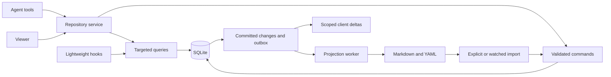

# A SQLite-native Taskmaster

Proposal, 2026-09-09. Builds on the performance audit and optimization roadmap.
No runtime changes are implemented by this document. Performance targets below
are design goals, not benchmark results.

## Architectural direction

Use SQLite as the operating model, not only as the place where the compatibility
backlog dictionary is stored. Normal reads should retrieve their answer directly;
normal writes should express their intent directly. Markdown/YAML remain useful
portable artifacts, but their serialization and synchronization should have an
explicit lifecycle outside ordinary database commands.

The current design already declares SQLite authoritative. The remaining costs
come from retaining the old document-shaped interfaces and maintaining broad
derived state synchronously. The audits measured multi-second tiny writes,
whole-tree loads for small reads, and a 16.2 MB viewer response. These are the
contracts this proposal changes.

## Target shape



One repository service owns writes, migrations, projection coordination and
subscriptions. Agent-specific MCP processes become thin adapters. Read-only
hooks can retain inexpensive direct SQLite reads when the schema contract allows
it; they need not import the entire server just to check a merge gate.

The service is not a way to make SQLite have multiple concurrent writers. It is
a way to avoid duplicate scans/caches, coordinate short writes, expose queue
state and keep unrelated work outside those writes. WAL still allows only one
writer at a time: [SQLite WAL](https://www.sqlite.org/wal.html).

## 1. Remove the compatibility dictionary from normal operations

Replace `_load()`, `transaction_dict()` and full-tree diffing at tool boundaries
with explicit repository operations. For example:

```text
get_task(id, fields=[status, title, next_step])
list_tasks(filters, columns, cursor, limit)
change_task(id, expected_revision, patch, request_id)
create_handover(metadata, body, memberships, request_id)
```

A next-step edit reads/updates that entity, records its change, and marks its
projection dirty. It does not traverse other tasks, reload all handovers, rebuild
path relationships, or render the board. A handover gets a row, document, and
membership rows; “latest 30” is a query, not an index list to rewrite and use as
runtime authority. Keep the old archival policy as explicit maintenance until
changing its semantics is a deliberate product decision.

Legacy tool names can initially translate into these operations. Keep full-tree
reconstruction only for exports and explicitly requested compatibility reads,
with telemetry proving it has left the normal path.

## 2. Store operational fields relationally; load prose separately

Use a hybrid schema, with one canonical representation per field:

| Data | Proposed storage |
|---|---|
| Entity identity and list/filter fields | Typed columns: stable internal integer key, human kind/ID, title, status, priority, owner, epic, phase, revision |
| Long prose | Separate document rows; load only on request |
| Dependencies | Indexed source/target edge rows |
| Handovers and task membership | Handover metadata plus join rows |
| Declared typed links | One canonical directed edge; reverse lookup by target index |
| Exact paths and glob patterns | Interned path/pattern rows plus entity claim rows |
| Extension fields | JSON, optionally SQLite JSONB after measuring |
| Changes and retry deduplication | Committed event rows and request receipts |
| Projection work | Durable outbox with entity revision and synchronization status |

Retain public human IDs and non-recycling behavior. Internal integers reduce
repeated long string keys in joins, graph edges and FTS identity. Do not use an
unstable implicit rowid as an external reference. Use explicit stable keys,
uniqueness constraints, foreign keys and appropriate indexes.

Move frequently filtered fields out of opaque `doc` JSON. Keep genuinely
extensible fields in JSON rather than inventing hundreds of mostly empty columns.
JSONB can avoid repeated JSON parsing, but SQLite does not promise O(1) JSONB
member lookup; it is not a substitute for indexed columns. Convert it to ordinary
JSON at tool/export boundaries. [SQLite JSON documentation](https://www.sqlite.org/json1.html)

Do not split Markdown into independently authoritative sections until round-trip
semantics are defined. Initially retain its original body as one document and
derive section offsets or section previews as replaceable metadata.

## 3. Treat an edit as a small command transaction

The transaction should contain:

1. Validate state-dependent invariants and the expected entity revision.
2. Apply only the intended changes and relationships.
3. Maintain necessary local indexes and any small exact aggregates.
4. Append an event, idempotency receipt and projection outbox entry.
5. Commit, then return the durable receipt.

For example, a compare-and-swap update can constrain both ID and revision. A
conflict returns the current revision/changed fields so the agent can rebase its
intent. Unrelated entity updates do not invalidate this entity's revision.
Field-level merge can be added later for independent edits, with explicit rules
for overlapping fields.

Validate syntax and enums before entering the writer queue. Keep gate checks,
claim checks and dependency-sensitive transitions inside the transaction. Do
not expose unrestricted writable SQL to agents as a replacement for domain
commands: raw SQL can bypass task lifecycle and completion invariants.

Use structured batch commands for one logical operation. Transactions and
savepoints can support all-or-nothing batches or explicitly defined partial
results. Do not accidentally couple unrelated agents' success/failure by merging
their operations into an undocumented atomic batch.

## 4. Move projection out of the writer transaction

This is the largest contract change. A successful edit means the database state
is durable; the files may follow asynchronously. Return both facts explicitly:

```json
{"id":"example-042","revision":19,"commit_seq":8124,"projection":"pending"}
```

The outbox commits with the entity change. Export jobs carry revisions; workers
must not overwrite a newer projection with an older job. Repeated edits may be
coalesced, provided all earlier effects are superseded coherently. Jobs must
handle archive moves, tombstones, crashes, line endings and quarantined hand edits.
Continue to treat missing files as non-deletions unless an explicit command
creates the tombstone.

Add a barrier such as `sync(flush_through=8124)`. Git-facing workflows wait until
all effects through that sequence are exported or coherently superseded, with
conflicts reported. A task's row commit and a multi-file Git projection are two
different completion boundaries.

Git integration must coordinate export/import around commit, checkout and merge.
A branch change does not silently create a branch-local runtime backlog: retain
the existing main-checkout/per-repository ownership rule unless separately
redesigned. The worker must detect newer external file edits before replacing
them; asynchronous export is not permission to overwrite hand edits.

An explicit-sync mode is the fastest and simplest runtime: external file edits
become visible after import/sync. A watcher mode can reduce delay but requires
overflow detection and periodic reconciliation. Offering a clearly defined mode
is better than promising immediate bidirectional file visibility without paying
for its checks.

## 5. Query relationships instead of materializing every possible pair

Intern exact paths once and represent ownership as `entity ↔ path`. Two entities
sharing a path can be found through indexed joins. That stores claims rather
than expanding every shared path into an entity clique.

Store glob patterns separately, with literal prefixes for candidate lookup.
Preserve current `fnmatchcase` semantics where compatibility is required; SQLite
GLOB or LIKE is not an automatic semantic replacement. Cache pattern/path
matches by their input revisions if they are repeatedly requested.

Keep declared links and dependency edges authoritative. Reverse links can be
queried through a reverse index or a compatibility view instead of deleting and
reinserting all mirror edges. Preserve relationship type inverses and cases
where both directions were explicitly declared.

For dependency ancestry, descendants and bounded impact queries, recursive CTEs
can traverse edge tables directly. They still need cycle handling, result/depth
budgets and appropriate indexes; arbitrary graph traversal is not free.
[SQLite WITH and recursive CTEs](https://www.sqlite.org/lang_with.html)

The existing `related` table can become a compatibility materialization built on
demand or at maintenance boundaries. Its SQL visibility and weighted/duplicate
semantics must remain explicit. If the main need is a small ranked neighborhood,
provide that API rather than computing every pair for every edit.

## 6. Maintain only the indexes that changed

Use stable document keys for FTS5 updates. A priority or ownership change should
not replace an FTS document if the indexed prose is unchanged. External-content
FTS is an option for avoiding duplicate text, but requires reliable maintenance
and reconciliation between the content table and index.
[SQLite FTS5](https://www.sqlite.org/fts5.html)

Similarly, path membership, dependency membership, declared links and handover
membership each get their own change detection. Maintain small aggregate counts
on affected epic/phase rows or query them via indexed SQL. Do not run a global
context builder to answer every status request.

Use triggers only for small deterministic invariants or outbox/index bookkeeping
that every write path must obey. Keep expensive graph work and complex lifecycle
policy visible in the command layer. A trigger that performs global work merely
hides the same performance problem inside SQLite.

## 7. Change how agents acquire context

A SQLite-native store can make the agent workflow more efficient, not just its
individual calls. Provide a bounded context query that fetches a useful bundle
in one consistent snapshot:

```text
context(task_id, include=[task, dependencies, gates, open_bugs, decisions],
        since_cursor=..., max_bytes=...)
```

Return compact selected fields, explicit provenance, entity revisions, omission
counts and a continuation cursor. Prose sections remain separately retrievable.
The cursor contains store identity and a sequence; store rebuilds or expired
history force a clean snapshot. A budget must not silently omit blocking gates:
return those first or report that the result is incomplete.

Add scoped `changes_since` so an agent can ask what changed during its work
instead of rereading status, tasks, bugs and handovers. Supplying `task_id` or
explicit scope keeps another team's unrelated changes out of its context.

Offer atomic claim/lease operations for agents: selecting an eligible task,
validating dependencies and claiming it happen together. This avoids the
read-candidate/peer-claims/write-stale-state race. Expiry, renewal and release
remain explicit; the server does not decide that unfinished work is complete.

Keep capability-focused tools such as context, query, validated mutations and
sync, with compatibility wrappers for today's names. Smaller schemas and fewer
round trips may reduce agent overhead, but measure discovery/error rates before
replacing clear typed tools with an overly generic dispatcher.

## 8. Give the viewer scoped snapshots and deltas

The board gets compact task rows once, not bodies or internal `_rows`. Detail
views retrieve a document when opened. Clients retain a scoped revision cursor;
unchanged reads return 304, and changed reads return only affected rows/removals.

Filtered views need membership transitions: when a task leaves the filter, send
a removal, not merely a patch the client will never request. Use a retained
history watermark and full-resync fallback so cursor compaction cannot silently
drop updates. Keep editable payloads tied to their snapshot revisions.

The event/outbox model also supports notifications over an appropriate transport,
but do not assume every MCP host implements subscriptions. Plain delta queries
remain the portable interface; the viewer can use SSE or a local subscription.

## 9. Centralize expensive coordination, not every possible read

One local service per repository can own the write queue, prepared queries,
schema version, import watcher and exporter. It can report queue delay separately
from execution, refuse incompatible client versions, and clean up abandoned
sessions. Use local authenticated/capability-scoped IPC appropriate to the host.

A service outage needs a defined policy: reconnect/restart, diagnostics and
read-only committed snapshots can remain available. Avoid silently launching a
second independent writer/exporter. Retain a repository ownership lock and
main-checkout root verification. Direct hook reads must not mutate or migrate
the database.

Do not assume a Rust rewrite is required. Removing full-tree materialization,
all-pairs rebuilding and synchronous file work should be measured first. A small
compiled adapter/service could later reduce startup and hook overhead if that
becomes the dominant cost.

## Proposed order

1. Introduce the query/command repository API and stable row identities behind
   existing tools. Add indexes, targeted updates and derived input tracking.
2. Add bounded context bundles, batched commands and compact viewer responses.
   Keep current projection timing while checking behavior against the old tools.
3. Introduce the transactional outbox and explicit projection receipts/barrier.
   Migrate Git workflows before making async projection the normal mode.
4. Add service coordination and scoped change feeds where measurements justify
   them. Replace global relationship materialization with neighborhood queries
   once its consumers and compatibility contract have been migrated.
5. Retire compatibility dictionary paths from normal operations. Keep imports,
   exports, full rebuilds and old query views as explicit compatibility facilities.

Acceptance should include field updates whose work does not grow with unrelated
backlog size, small bounded query responses, durable idempotent receipts, exact
relationship/search equivalence where promised, successful multi-agent writes,
and Git barrier/crash recovery tests. Target tens of milliseconds for the DB
command core and sub-100-ms warm bounded reads as hypotheses to test, not promises
about MCP/model/network latency. Do not relax `synchronous=FULL` or drop the
correctness checks to manufacture a fast benchmark.

The FTS integrity diagnostic from the broader audit remains a separate unresolved
validation issue: it reproduced with the existing algorithm and disappeared on
fresh connections. Resolve its cause before treating concurrency acceptance as
complete for a rewritten store.
